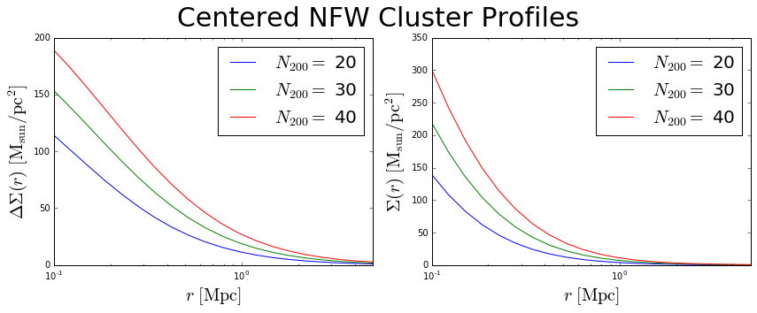

Demo
=============================

Some example usage of how to build up a dataframe of galaxy cluster
properties, including NFW halo profiles. Each cluster is treated as an
individual, meaning we track its individual mass and redshift, and other
properties. This is useful for fitting a stacked weak lensing profile,
for example, where you want to avoid fitting a single average cluster
mass.

.. code-block:: python

    from __future__ import print_function
    
    %matplotlib inline
    %load_ext autoreload
    %autoreload 2
    
    import numpy as np
    from astropy import units
    from matplotlib import pyplot as plt
    
    from clusterlensing.clusters import ClusterEnsemble

Create a ClusterEnsemble object by passing in a numpy array (or list) of redshifts
-------------------------------------------------------------------------

.. code-block:: python

    z = [0.1,0.2,0.3]
    c = ClusterEnsemble(z)
    c.describe

.. parsed-literal::

    'Ensemble of galaxy clusters and their properties.'

Display what we have so far
-----------------------------

Below the DataFrame (which so far only contains the cluster redshifts),
we see the default assumptions for the power-law slope and normalization
that will be used to convert richness :math:`N_{200}` to mass
:math:`M_{200}`. We'll see how to change those parameters below.

.. code-block:: python

    c.show()

.. parsed-literal::

    
    Cluster Ensemble:

.. raw:: html

    

    <table border="1" class="dataframe">
      <thead>
        <tr style="text-align: right;">
          <th></th>
          <th>z</th>
        </tr>
      </thead>
      <tbody>
        <tr>
          <th>0</th>
          <td>0.1</td>
        </tr>
        <tr>
          <th>1</th>
          <td>0.2</td>
        </tr>
        <tr>
          <th>2</th>
          <td>0.3</td>
        </tr>
      </tbody>
    </table>
    

.. parsed-literal::

    
    Mass-Richness Power Law: M200 = norm * (N200 / 20) ^ slope
       norm: 2.7e+13 solMass
       slope: 1.4

Add richness values to the dataframe
------------------------------------

This step will also generate :math:`M_{200}`, :math:`r_{200}`,
:math:`c_{200}`, scale radius :math:`r_s`, and other parameters,
assuming the scaling relation given below.

.. code-block:: python

    n200 = np.ones(3)*20.
    c.n200 = n200
    c.show()

.. parsed-literal::

    
    Cluster Ensemble:

.. raw:: html

    

    <table border="1" class="dataframe">
      <thead>
        <tr style="text-align: right;">
          <th></th>
          <th>z</th>
          <th>n200</th>
          <th>m200</th>
          <th>r200</th>
          <th>c200</th>
          <th>delta_c</th>
          <th>rs</th>
        </tr>
      </thead>
      <tbody>
        <tr>
          <th>0</th>
          <td>0.1</td>
          <td>20</td>
          <td>2.700000e+13</td>
          <td>0.612222</td>
          <td>5.839934</td>
          <td>12421.201995</td>
          <td>0.104834</td>
        </tr>
        <tr>
          <th>1</th>
          <td>0.2</td>
          <td>20</td>
          <td>2.700000e+13</td>
          <td>0.591082</td>
          <td>5.644512</td>
          <td>11480.644557</td>
          <td>0.104718</td>
        </tr>
        <tr>
          <th>2</th>
          <td>0.3</td>
          <td>20</td>
          <td>2.700000e+13</td>
          <td>0.569474</td>
          <td>5.442457</td>
          <td>10555.781440</td>
          <td>0.104636</td>
        </tr>
      </tbody>
    </table>
    

.. parsed-literal::

    
    Mass-Richness Power Law: M200 = norm * (N200 / 20) ^ slope
       norm: 2.7e+13 solMass
       slope: 1.4

Access any column of the dataframe as an array
--------------------------------------------

Notice that `astropy units <http://docs.astropy.org/en/stable/units/>`__
are present for the appropriate columns.

.. code-block:: python

    print('z: \t', c.z)
    print('n200: \t', c.n200)
    print('r200: \t', c.r200)
    print('m200: \t', c.m200)
    print('c200: \t', c.c200)
    print('rs: \t', c.rs)

.. parsed-literal::

    z: 	 [ 0.1  0.2  0.3]
    n200: 	 [ 20.  20.  20.]
    r200: 	 [ 0.61222163  0.59108187  0.56947428] Mpc
    m200: 	 [  2.70000000e+13   2.70000000e+13   2.70000000e+13] solMass
    c200: 	 [ 5.8399338   5.64451215  5.44245689]
    rs: 	 [ 0.10483366  0.10471797  0.10463552] Mpc

If you don't want units, you can get just the values
----------------------------------------------

.. code-block:: python

    c.r200.value

.. parsed-literal::

    array([ 0.61222163,  0.59108187,  0.56947428])

Or access the Pandas DataFrame directly
----------------------------------------

.. code-block:: python

    c.dataframe

.. raw:: html

    

    <table border="1" class="dataframe">
      <thead>
        <tr style="text-align: right;">
          <th></th>
          <th>z</th>
          <th>n200</th>
          <th>m200</th>
          <th>r200</th>
          <th>c200</th>
          <th>delta_c</th>
          <th>rs</th>
        </tr>
      </thead>
      <tbody>
        <tr>
          <th>0</th>
          <td>0.1</td>
          <td>20</td>
          <td>2.700000e+13</td>
          <td>0.612222</td>
          <td>5.839934</td>
          <td>12421.201995</td>
          <td>0.104834</td>
        </tr>
        <tr>
          <th>1</th>
          <td>0.2</td>
          <td>20</td>
          <td>2.700000e+13</td>
          <td>0.591082</td>
          <td>5.644512</td>
          <td>11480.644557</td>
          <td>0.104718</td>
        </tr>
        <tr>
          <th>2</th>
          <td>0.3</td>
          <td>20</td>
          <td>2.700000e+13</td>
          <td>0.569474</td>
          <td>5.442457</td>
          <td>10555.781440</td>
          <td>0.104636</td>
        </tr>
      </tbody>
    </table>
    

Change the redshifts
-------------------------

These changes will propogate to all redshift-dependant cluster
attributes.

.. code-block:: python

    c.z = np.array([0.4,0.5,0.6])
    c.dataframe

.. raw:: html

    

    <table border="1" class="dataframe">
      <thead>
        <tr style="text-align: right;">
          <th></th>
          <th>z</th>
          <th>n200</th>
          <th>m200</th>
          <th>r200</th>
          <th>c200</th>
          <th>delta_c</th>
          <th>rs</th>
        </tr>
      </thead>
      <tbody>
        <tr>
          <th>0</th>
          <td>0.4</td>
          <td>20</td>
          <td>2.700000e+13</td>
          <td>0.547827</td>
          <td>5.244512</td>
          <td>9695.735436</td>
          <td>0.104457</td>
        </tr>
        <tr>
          <th>1</th>
          <td>0.5</td>
          <td>20</td>
          <td>2.700000e+13</td>
          <td>0.526483</td>
          <td>5.055666</td>
          <td>8916.795783</td>
          <td>0.104137</td>
        </tr>
        <tr>
          <th>2</th>
          <td>0.6</td>
          <td>20</td>
          <td>2.700000e+13</td>
          <td>0.505701</td>
          <td>4.878356</td>
          <td>8221.639808</td>
          <td>0.103662</td>
        </tr>
      </tbody>
    </table>
    

Change the mass or richness values
------------------------------------

Changing mass will affect richness and vice-versa, through the
mass-richness scaling relation. These changes will propogate to all
mass-dependant cluster attributes, as appropriate.

.. code-block:: python

    c.m200 = [3e13,2e14,1e15]
    c.show()

.. parsed-literal::

    
    Cluster Ensemble:

.. raw:: html

    

    <table border="1" class="dataframe">
      <thead>
        <tr style="text-align: right;">
          <th></th>
          <th>z</th>
          <th>n200</th>
          <th>m200</th>
          <th>r200</th>
          <th>c200</th>
          <th>delta_c</th>
          <th>rs</th>
        </tr>
      </thead>
      <tbody>
        <tr>
          <th>0</th>
          <td>0.4</td>
          <td>21.563235</td>
          <td>3.000000e+13</td>
          <td>0.567408</td>
          <td>5.194688</td>
          <td>9486.316304</td>
          <td>0.109229</td>
        </tr>
        <tr>
          <th>1</th>
          <td>0.5</td>
          <td>83.602673</td>
          <td>2.000000e+14</td>
          <td>1.026296</td>
          <td>4.238847</td>
          <td>5994.835515</td>
          <td>0.242117</td>
        </tr>
        <tr>
          <th>2</th>
          <td>0.6</td>
          <td>263.927382</td>
          <td>1.000000e+15</td>
          <td>1.685668</td>
          <td>3.583538</td>
          <td>4142.243702</td>
          <td>0.470392</td>
        </tr>
      </tbody>
    </table>
    

.. parsed-literal::

    
    Mass-Richness Power Law: M200 = norm * (N200 / 20) ^ slope
       norm: 2.7e+13 solMass
       slope: 1.4

.. code-block:: python

    c.n200 = [20,30,40]
    c.show()

.. parsed-literal::

    
    Cluster Ensemble:

.. raw:: html

    

    <table border="1" class="dataframe">
      <thead>
        <tr style="text-align: right;">
          <th></th>
          <th>z</th>
          <th>n200</th>
          <th>m200</th>
          <th>r200</th>
          <th>c200</th>
          <th>delta_c</th>
          <th>rs</th>
        </tr>
      </thead>
      <tbody>
        <tr>
          <th>0</th>
          <td>0.4</td>
          <td>20</td>
          <td>2.700000e+13</td>
          <td>0.547827</td>
          <td>5.244512</td>
          <td>9695.735436</td>
          <td>0.104457</td>
        </tr>
        <tr>
          <th>1</th>
          <td>0.5</td>
          <td>30</td>
          <td>4.763120e+13</td>
          <td>0.636151</td>
          <td>4.809323</td>
          <td>7960.321226</td>
          <td>0.132274</td>
        </tr>
        <tr>
          <th>2</th>
          <td>0.6</td>
          <td>40</td>
          <td>7.125343e+13</td>
          <td>0.698834</td>
          <td>4.490373</td>
          <td>6819.417449</td>
          <td>0.155629</td>
        </tr>
      </tbody>
    </table>
    

.. parsed-literal::

    
    Mass-Richness Power Law: M200 = norm * (N200 / 20) ^ slope
       norm: 2.7e+13 solMass
       slope: 1.4

Change the parameters in the mass-richness relation
----------------------------------------------------

The mass-richness slope and normalization can both be changed. The new
parameters will be applied to the current n200, and will propagate to
mass and other dependant quantities.

.. code-block:: python

    c.massrich_slope = 1.5
    c.show()

.. parsed-literal::

    
    Cluster Ensemble:

.. raw:: html

    

    <table border="1" class="dataframe">
      <thead>
        <tr style="text-align: right;">
          <th></th>
          <th>z</th>
          <th>n200</th>
          <th>m200</th>
          <th>r200</th>
          <th>c200</th>
          <th>delta_c</th>
          <th>rs</th>
        </tr>
      </thead>
      <tbody>
        <tr>
          <th>0</th>
          <td>0.4</td>
          <td>20</td>
          <td>2.700000e+13</td>
          <td>0.547827</td>
          <td>5.244512</td>
          <td>9695.735436</td>
          <td>0.104457</td>
        </tr>
        <tr>
          <th>1</th>
          <td>0.5</td>
          <td>30</td>
          <td>4.960217e+13</td>
          <td>0.644807</td>
          <td>4.792194</td>
          <td>7896.280856</td>
          <td>0.134554</td>
        </tr>
        <tr>
          <th>2</th>
          <td>0.6</td>
          <td>40</td>
          <td>7.636753e+13</td>
          <td>0.715169</td>
          <td>4.463870</td>
          <td>6729.455181</td>
          <td>0.160213</td>
        </tr>
      </tbody>
    </table>
    

.. parsed-literal::

    
    Mass-Richness Power Law: M200 = norm * (N200 / 20) ^ slope
       norm: 2.7e+13 solMass
       slope: 1.5

.. code-block:: python

    # Show basic table without Pandas formatting
    c.show(notebook = False)

.. parsed-literal::

    
    Cluster Ensemble:
         z  n200          m200      r200      c200      delta_c        rs
    0  0.4    20  2.700000e+13  0.547827  5.244512  9695.735436  0.104457
    1  0.5    30  4.960217e+13  0.644807  4.792194  7896.280856  0.134554
    2  0.6    40  7.636753e+13  0.715169  4.463870  6729.455181  0.160213
    
    Mass-Richness Power Law: M200 = norm * (N200 / 20) ^ slope
       norm: 2.7e+13 solMass
       slope: 1.5

Calculate :math:`\Sigma(r)` and :math:`\Delta\Sigma(r)` for NFW model
~~~~~~~~~~~~~~~~~~~~~~~~~~~~~~~~~~~~~~~~~~~~~~~~~~~~~~~~~~~~~

First select the radial bins in units of Mpc.

.. code-block:: python

    rmin, rmax = 0.1, 5. # Mpc
    nbins = 20
    rbins = np.logspace(np.log10(rmin), np.log10(rmax), num = nbins)
    print('rbins range from', rbins.min(), 'to', rbins.max(), 'Mpc')

.. parsed-literal::

    rbins range from 0.1 to 5.0 Mpc

.. code-block:: python

    c.calc_nfw(rbins)    # calculate the profiles
    
    sigma = c.sigma_nfw  # access the profiles
    deltasigma = c.deltasigma_nfw

.. code-block:: python

    fig = plt.figure(figsize=(12,5))
    fig.suptitle('Centered NFW Cluster Profiles', size=30)
    
    first = fig.add_subplot(1,2,1)
    second = fig.add_subplot(1,2,2)
    
    for rich, profile in zip(c.n200,deltasigma):
        first.plot(rbins, profile, label='$N_{200}=$ '+str(rich))
    first.set_xscale('log')
    first.set_xlabel('$r\ [\mathrm{Mpc}]$', fontsize=20)
    first.set_ylabel('$\Delta\Sigma(r)\ [\mathrm{M}_\mathrm{sun}/\mathrm{pc}^2]$', 
                     fontsize=20)
    first.set_xlim(rbins.min(), rbins.max())
    first.legend(fontsize=20)
    
    
    for rich, profile in zip(c.n200,sigma):
        second.plot(rbins, profile, label='$N_{200}=$ '+str(rich))
    second.set_xscale('log')
    second.set_xlabel('$r\ [\mathrm{Mpc}]$', fontsize=20)
    second.set_ylabel('$\Sigma(r)\ [\mathrm{M}_\mathrm{sun}/\mathrm{pc}^2]$', 
                     fontsize=20)
    second.set_xlim(0.05, 1.)
    second.set_xlim(rbins.min(), rbins.max())
    second.legend(fontsize=20)
    
    
    fig.tight_layout()
    plt.subplots_adjust(top=0.88)

Calculate Miscentered NFW Profiles
~~~~~~~~~~~~~~~~~~~~~~~~~~~~~~~~~~~~~

When the true underlying dark matter distribution is offset from the
assumed cluster "center" (such as a BCG or some other center proxy), the
weak lensing profiles measured around the assumed centers will be
different than for the perfectly centered case. One way to account for
this is to describe the cluster centroid offsets as a Gaussian
distribution around the true centers. We say the probability of an
offset is given by

:math:`P(R_\mathrm{off}) = \frac{R_\mathrm{off}}{\sigma_\mathrm{off}^2}e^{-\frac{1}{2}\left(\frac{R_\mathrm{off}}{\sigma_\mathrm{off}}\right)^2}`,

which is parameterized by the width of the 2D offset distribution
:math:`\sigma_\mathrm{off} = \sqrt{\sigma_x^2 + \sigma_y^2}`. Then the
measured surface mass density is given by

:math:`\Sigma^\mathrm{sm}(R) = \int_0^\infty \Sigma(R | R_\mathrm{off})\  P(R_\mathrm{off})\ \mathrm{d}R_\mathrm{off}`,

where

:math:`\Sigma(R | R_\mathrm{off}) = \frac{1}{2\pi} \int_0^{2\pi} \Sigma(r')\ \mathrm{d}\theta`,

and

:math:`r' = \sqrt{R^2 + R_\mathrm{off}^2 - R R_\mathrm{off} \cos{\theta}}`.

More details on the cluster miscentering problem can be found in `Ford
et al 2015 <http://arxiv.org/abs/1409.3571>`__, `George et al
2012 <http://arxiv.org/abs/1205.4262>`__, and `Johnston et al
2007 <http://arxiv.org/abs/0709.1159>`__.

To calculate the miscentered profiles, simply create an array of offsets
in units of Mpc, and pass it to the calc\_nfw method:

.. code-block:: python

    offsets = np.array([0.1,0.1,0.1]) #same length as number of clusters
    
    c.calc_nfw(rbins, offsets=offsets)
    
    deltasigma_off = c.deltasigma_nfw
    sigma_off = c.sigma_nfw

.. code-block:: python

    fig = plt.figure(figsize=(12,5))
    fig.suptitle('Miscentered NFW Cluster Profiles', size=30)
    
    first = fig.add_subplot(1,2,1)
    second = fig.add_subplot(1,2,2)
    
    for rich, profile in zip(c.n200,deltasigma_off):
        first.plot(rbins, profile, label='$N_{200}=$ '+str(rich))
    first.set_xscale('log')
    first.set_xlabel('$r\ [\mathrm{Mpc}]$', fontsize=20)
    ytitle = '$\Delta\Sigma^\mathrm{sm}(r)\ [\mathrm{M}_\mathrm{sun}/\mathrm{pc}^2]$'
    first.set_ylabel(ytitle, fontsize=20)
    first.set_xlim(rbins.min(), rbins.max())
    first.legend(fontsize=20)
    
    
    for rich, profile in zip(c.n200,sigma_off):
        second.plot(rbins, profile, label='$N_{200}=$ '+str(rich))
    second.set_xscale('log')
    second.set_xlabel('$r\ [\mathrm{Mpc}]$', fontsize=20)
    ytitle = '$\Sigma^\mathrm{sm}(r)\ [\mathrm{M}_\mathrm{sun}/\mathrm{pc}^2]$'
    second.set_ylabel(ytitle, fontsize=20)
    second.set_xlim(rbins.min(), rbins.max())
    second.legend(fontsize=20)
    
    
    fig.tight_layout()
    plt.subplots_adjust(top=0.88)

.. image:: demo_files/demo_29_0.png

Advanced use: tuning the precision of the integrations
---------------------------------------------------------

The centered profile calculations are straightforward, and this package
uses the formulas given in `Wright & Brainerd
2000 <http://adsabs.harvard.edu/abs/2000ApJ...534...34W>`__ for this.
However, as outlined above, the calculation of the miscentered profiles
requires a double integration for :math:`\Sigma^\mathrm{sm}(R)`, and
there is a third integration for :math:`\Delta\Sigma^\mathrm{sm}(R)`.

For increased precision, you can adjust parameters specifying the number
of bins to use in these integration (but note that this comes at the
expense of increased computational time). See the
`documentation <jesford.github.io/cluster-lensing>`__ for details.
